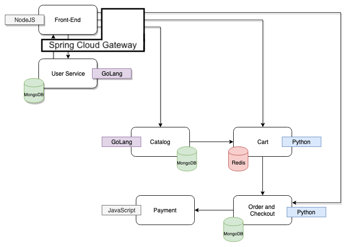

# Demo of ACME Fitness Shop

## Getting Started

These instructions will allow you to run entire ACME Fitness Shop with [Spring Cloud Gateway for kubernetes](https://docs.pivotal.io/scg-k8s/1-0/).

## Overview



Source code of the related apps:
- Front End: https://github.com/pivotal-cf/acme-shopping
- User Service: https://github.com/pivotal-cf/acme-user
- Catalog: https://github.com/pivotal-cf/acme-catalog
- Cart: https://github.com/pivotal-cf/acme-cart
- Order: https://github.com/pivotal-cf/acme-order
- Payment: https://github.com/pivotal-cf/acme-payment

## Try it out

### Deploying to k8s

1. [Install Spring Cloud Gateway for kubernetes](https://docs.pivotal.io/scg-k8s/1-0/installation.html) before running the following command.

1. Create a secret file to specify the password for databases to use and for the deployed apps to access the databases. The `<value>` can be any value.

    ```
    echo 'password=<value>' > kubernetes-manifests/.env.secret
    ```

1. Create a secret file for wavefront access. This is for your gateway to publish metrics and tracing data. 

    ```
    echo 'wavefront.api-token=<token>
    wavefront.uri=<uri>' > kubernetes-manifests/.env.wavefront.secret
    kustomize build kubernetes-manifests/ | kubectl apply -f -
    ```
    
    If you don't have wavefront instance/token handy, you may disable tracing and metrics by deleting the `tracing` and `metrics` section in [gateway.yaml](./kubernetes-manifests/gateway.yaml), and removing `wavefront-secret` secret generator in [kustomization.yaml](./kubernetes-manifests/kustomization.yaml).

1. Deploy all resources with Kustomize:
   
    ```
    kustomize build kubernetes-manifests/ | kubectl apply -f -
    ```

All resources are deployed to `acme-fitness` namespace. You may change the target namespace in [kustomization.yaml](./kubernetes-manifests/kustomization.yaml).

### Accessing the app

There is an ingress resource created for the gateway. You may add a DNS record to either a DNS registry or in your local `/etc/hosts`:

```
<your.ingress.ip.address>   acme-fitness.spring.animalrescue.online
```

You may also port-forward the gateway service to expose the app:

```
kubectl port-forward service/gateway 8080:80 -n acme-fitness
```

### Available users

There are four pre-created users loaded into the database:

| User   | Password   |
|--------|------------|
| eric   | `vmware1!` |
| dwight | `vmware1!` |
| han    | `vmware1!` |
| phoebe | `vmware1!` |

* You MUST login as one of the users mentioned above to access all the pages in the application
* The current user service will set a cookie ```logged_in``` in the browser. This cookie contains the User ID returned from the user service
* The service uses JWT and sets 2 cookies - ```logged_in``` and ```refresh_token```

### API portal integration

If you'd like to use [API portal for VMware Tanzu](https://docs.pivotal.io/api-portal/1-0/installing.html) to view all the endpoints, you will need to install API portal with helm value:

```
api-portal-server:
   sourceUrls: "http://scg-operator.spring-cloud-gateway/openapi"
``` 

Or set environment variable on a pre-installed API portal deployment:

```
kubectl set env deployment.apps/api-portal-server API_PORTAL_SOURCE_URLS="http://scg-operator.spring-cloud-gateway/openapi"
kubectl rollout restart deployment api-portal-server
```

If your API portal is deployed in a different cluster, then you will need to add an ingress for `scg-operator` in your SCG installation namespace to expose the it, and use that url instead. 

The [gateway resource](./kubernetes-manifests/gateway.yaml) assumes API portal is using the URL `http://api-portal.spring.animalrescue.online`. To create an Ingress resource for your API portal with this URL, you may run:

```
kubectl apply -f kubernetes-manifests/api-portal-ingress.yaml -n api-portal
```

You may update the urls in the gateway resource if you want to use a different url for your API portal. 

### SSO integration

You may check out the `sso` branch to see how to replace the `acme-user` service with [SSO integration on Spring Cloud Gateway](https://docs.pivotal.io/scg-k8s/1-0/using-sso.html). 

## File Structure

You will notice the following directory structure

```text
├── README.md
├── acmeshop.png
├── aws-fargate
│   ├── README.md
│   ├── acme-fitness-shop.yaml
│   └── cf-template.png
├── docker-compose
│   ├── README.md
│   └── docker-compose.yml
├── kubernetes-manifests
│   ├── README.md
│   ├── gateway.yaml*
│   ├── api-portal-ingress.yaml*
│   ├── cart-redis-total.yaml
│   ├── cart-total.yaml
│   ├── cart-gateway-config.yaml*
│   ├── catalog-db-initdb-configmap.yaml
│   ├── catalog-db-total.yaml
│   ├── catalog-total.yaml
│   ├── catalog-v2-total.yaml
│   ├── catalog-gateway-config.yaml*
│   ├── frontend-total.yaml*
│   ├── frontend-gateway-config.yaml*
│   ├── order-db-total.yaml
│   ├── order-total.yaml
│   ├── order-gateway-config.yaml*
│   ├── payment-total.yaml
│   ├── users-db-initdb-configmap.yaml
│   ├── users-db-total.yaml
│   ├── users-total.yaml*
│   └── users-gateway-config.yaml*
└── traffic-generator
    ├── README.md
    ├── locustfile.py
    └── requirements.txt
```

The files marked with `*` are updated to work with Spring Cloud Gateway and API portal.

### Additional Info

The [traffic-generator](./traffic-generator) is based on **locust** and can be used to create various traffic patterns, if you need it for other demos associated with **Monitoring and Observability.**
